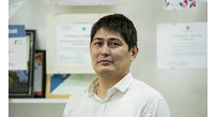

# **KURUCHBEKOV BAKYT ZAMIRBEKOVICH**

Address: 
Kyrgyzstan, Bishkek city, mkr Djal, 
tel.mob: 0559 559 548 
e-mail: bkuruchbekov312@gmail.com

_Male, 38 years old_ 

## WORK EXPERIENCE
- INFORMATION TECHNOLOGY AND INFORMATION SECURITY EXPERT (PUBLIC AND PRIVATE IT PROJECTS), IT/IS CONSULTANT, TO THE PRESENT.

- I AM A LECTURER IN THE DISCIPLINE "INFORMATION SECURITY" KSTU STATE TECHNICAL UNIVERSITY NAMED AFTER "I. RAZZAKOV", PART TIME - TO THE PRESENT. 

- LEADING SPECIALIST/SENIOR INSPECTOR OF THE INFORMATION SECURITY DEPARTMENT OF CJSC “KOMPANION BANK”, TOTAL WORK EXPERIENCE OF 4 - YEARS.

- CHIEF SPECIALIST OF THE ECONOMIC AND INFORMATION SECURITY DEPARTMENT OF THE SECURITY SERVICE, JSC “ROSINBANK”, TOTAL WORK EXPERIENCE OF 2 - YEARS.

- LEADING SPECIALIST OF ECONOMIC AND INFORMATION SECURITY DIVISION SECURITY DEPARTMENT, UNICREDIT/OPTIMA BANK JSC, TOTAL WORK EXPERIENCE OF 2 YEARS.
- TECHNICAL MANAGER, OSOO ALFA LEASING, TOTAL WORK EXPERIENCE OF 1.5 - YEARS. 

- IT SPECIALIST, “AYU” TRADEMARK, TOTAL WORK EXPERIENCE OF 4 - YEARS.

- SHIFT ENGINEER ON ELECTRONIC EQUIPMENT OF THE EARTH SATELLITE STATION OF THE INTERGOVERMENTAL TV AND RADIO COMPANY "MIR" IN THE KYRGYZ REPUBLIC, TOTAL WORK EXPERIENCE OF 6 - YEARS. 

## EDUCATION
'''Higher technical education, Kyrgyz State Technical University named after I. Razzakov.
- Faculty: Information Systems in Economics. 
Specialty: Information Systems and Technologies.
- Rome State University - Tor Vergata (Information Technology) - Master's degree.'''

Language Knowledge:
- Kyrgyz: fluent; 
- English: good; 
- Russian: fluent;

## ADVANCED TRAINING, COURSES.

- ISO 27001:2013 Introduction. Implementation. Internal audit at the enterprise. - BSI, Moscow, www.bsigroup.com 
- Kaspersky- ATM network protection. 
- Audit-IT according to Cobit-5 standard - KPMG. 
- GDPR - protection of personal data. 
- Cybrary - Penetration test (Ethical Hacking) - distance learning.
- Cybrary - mitre &attack - distance learning;
- Melon Carnegie - private university (USA) - Forensics - (computer forensics) - distance learning. 
- AUCA- American University of Central Asia - English - Upper-Intermediate. 

## ACTIVITY 
## Professional Skills:

- Implementation and support of automated information technologies, services and applications (core banking, electronic document management - EDM, corporate website, electronic corporate mail,cloud services - storage, IP-telephony - PBX, etc.) for financial institutions and international organizations.
- Development of various project technical documentation - requirements (Data Processing Centers - Data Center, structuring of cable system, Security, Fire and Alarm Systems, Video Surveillance Systems - CCTV and Access Control and Management Systems).   
- Experience and knowledge of protecting against cyber-attacks and sensitive corporate information leakage using specialized tools (software).
- Experience and skills in working with various manufacturers, vendors and software product developers. 
- Experience and skills in compliance control of legal entities and individuals (opinion writing) - economic security. 
- Implementation and organization of ISMS - Information Security Management System in the Bank/Organizations; 
- IT/ITS planning and budgeting;
- Organize and develop terms of reference for information security and information technology contractors; 
- Knowledge of international ITS/IT standards and methodologies on IS/IT SANS, CSSP, Comptia security+, CISM, CISA, Cobit -5, ITIL, Cybersecurity, CIS, NIST, MPAA, GOST-57580.1 (57580.2), PTES, CVSS, OWASP, ISO 2700X. PCI-DSS;
- Knowledge of regulatory legal documents of KR, RF, NBKR in the field of IS and development on their basis of internal regulatory documents, procedures and regulations (FSTEK FSS, etc.);
- Vulnerability scanning of IT infrastructure of the Bank/organizations; 
- Conducting maturity audits of IS organizations according to ISO-27001:2013;
- IT/IS Risk Assessment;
- Conducting IT audits as per Cobit-5, 27001:2013, ITIL standard;
- Conducting internal investigations of IS incidents;
- Experience with DLP systems;
- Experience with SIEM systems;
- Experience with enterprise antivirus systems;
- Knowledge of networking technologies - CCNA, MTCNA (CISCO, Palo-Alto, Check-Point, Mikrotik);
- Knowledge of DBMS - MS SQL, My SQL;
- Knowledge of Windows Servers 2008/2012/2016 (AD, GPO, WSUS, DNS, NTP);
- Knowledge of Linux - Operating Systems (Debian, Centos, Kubernetes, Dockers);
- Knowledge of IOS - video surveillance systems and ACS - access control and management systems; 
- Experience with servers and building a data center (data center);
- Experience with enterprise level virtualization software products (VMware ESXI, Microsoft Hyper-V, Proxmox-VE);
- Development of requirements for protection of the Bank's terminals and ATMs; 
- Experience with tools: Kali Linux, Wireshark, Acunetix, Nmap, Nessus, etc;
- Organizing, conducting trainings and briefings of the organizations' employees on the basics of IS and social engineering;
- Organizing and conducting stress tests of the Bank's employees for phishing emails; 
- Developing crisis management and BCP/DRP business continuity plans for the Bank/organizations;

## MISCELLANEOUS 
```
- I am fond of reading technical, historical literature, automobile engineering, repair and design of premises.
- Driver's license of categories "B".
```

